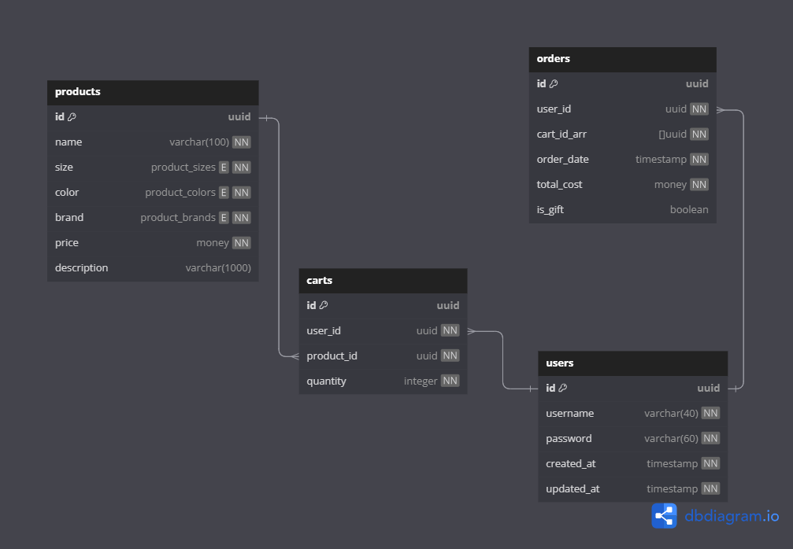

## Roll with the Punches E-Commerce

- project configured to be run in GutHub Codespaces

## Back-end: Node.js + PostgreSQL

### Database Schema


_generated using dbdiagram.io_

### API Design

- API documentation can be found at the `/api-docs` endpoint

### Auth

```shell
curl --data "username=admin&password=password" https://zany-halibut-p6x9ww64jc7w69-3000.app.github.dev/login
```

## TODO

- start on cart endpoints
